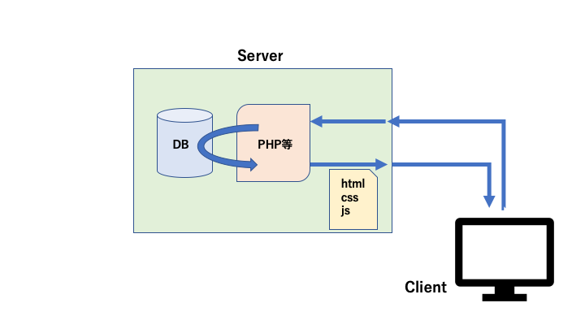
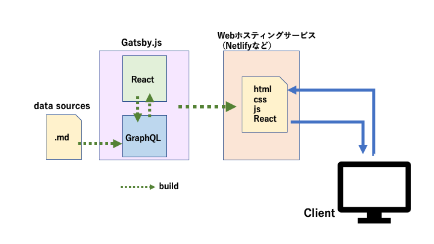

ブログを書きたいという気持ちがあまりなかったのですが、Gatsby.jsというものがあることを知り、試したくなって早速自分のブログ（このサイト）を作ってみました。
 

## Gatsby.jsとは
Gatsby.jsはReactベースの静的サイトジェネレーターです。

### 通常のサイト（動的サイト）の場合

HTTPリクエストを受けてからサーバーサイドの言語（PHP等）が動いてページを作るため、
URLにアクセスしてからページが表示されるまで時間がかかります。

### Gatsby.jsの場合

<a href="https://www.gatsbyjs.org/" target="_blank">参考：Gatsby.js公式</a>

Gatsby.jsなどの静的サイトジェネレーターの場合は、ビルド時にソースから静的HTMLを生成しておいてくれるので、
URLにアクセスしたらすぐHTMLが返ってくる状態になります。

そのため、ネット上ではよく「爆速」と表現されてますが、表示速度がとにかく速いです。

また上の図ではdata sourcesとして .mdファイルからデータを取得していますが、
Gatsby.jsは.mdファイルの他に、WordPressやDB等色々なところからデータを持ってこれるようです。

 

## ブログ作成
環境構築、どころかデプロイまでの一連の流れがとても簡単でした。

実際僕も以下の記事を見ながら、（のんびりやったので5分ではないですが、多分20分くらいで）簡単にこのサイトの初回デプロイができました。

<a href="https://qiita.com/k-penguin-sato/items/7554e5e7e90aa10ae225" target="_blank">GatsbyとNetlifyで簡単にブログを作成 - Qiita</a>

僕は.mdファイルを直接編集していますが、必要であれば
<a href="https://www.contentful.com/" target="_blank">Contentful</a>
などを連携させることもできるようです。
サーバーレスなので、Netlifyの無料枠で運用コスト0円なのも嬉しい。

### スターター
<a href="https://www.gatsbyjs.org/starters/?v=2" target="_blank">スターター</a>
というものがあり、これをベースにすればすぐにサイトを構築できます。
シンプルな実装のものから完成度が高いものまで様々あります。

僕はTypescriptで書かれているものの中から、シンプルで、かつできるだけそのまま使えそうな
<a href="https://www.gatsbyjs.org/starters/fabien0102/gatsby-starter/" target="_blank">こちら(gatsby-starter)</a>を使用しました
（実際は、細かい部分を色々変更したので意外と時間がかかってしまいましたが、機能はもともと揃っていました）。

 
ちなみに公式のドキュメントは親切丁寧ですが、英語のみです。
 

## 注意点

### webアプリには不向き

このサイトのデータソースは基本的にブログ記事の.mdファイルや画像ファイルのみで、build時にGraphQLのクエリで取り込まれます。

逆にデータソースの変化をページに反映させるにはいちいちbuildしなければならないため、

例えば、コメント機能のようなものはおそらく単独では実現できません

（このサイトもコメント機能はdisqusという外部サービスを使用しています）。

WebアプリのようにDBへの読み書きが多い用途には使えなさそうです。

 

## 感想
Gatsby.jsを色々いじってみて、楽しいのでとりあえず満足していますが、
このブログもあまりに簡単にできてしまったのでGatsby.jsへ対する理解が浅いままで、書けることがあまりないorz

勉強のためには、スターターで楽をしないで1から作った方が良かったかも。

ブログを書くのはどのくらいモチベーションが続くか分からないですが、まず10件くらい目標に記事を書きたいです。

 
さて、そろそろReact Nativeの開発に戻ります...
